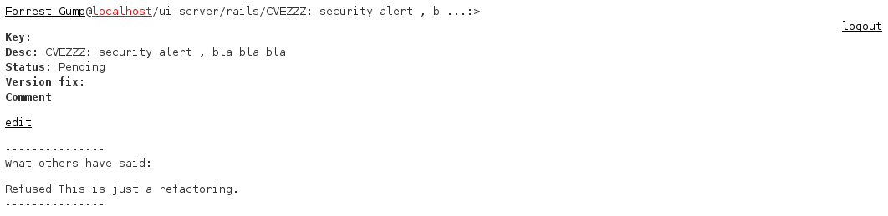

gems-status-web
===============

web interface for the [gems-status](http://github.com/jordimassaguerpla/gems-status)
# What is gems-status-web?

Gems-status-web is a rails web application that will tell you which security alerts exist on the gems you use on a ruby application.

It works as:

1. it will get the list of gems from the Gemfile.lock file of your ruby application
2. it will look for "suspicious" commits in the source code of those gems
3. it will look for the gem name in the most known security mailing lists.

With that information, it will output a table as well as send you an email.

The user, can look at the alerts and decide whether he wants to consider them or otherwise reject or ignore it.

Since you get the same alerts as the other users, you can see what other users have decided on that same security alert.

# Screenshots

This is the list of the security alerts for a user:

This is when a user wants to review a security alert. Note the "What others have said" section.

This is the user profile. Note the api token.

# Jenkins integration

gems-status-web can be intregrated in jenkins by using curl and an api token. This is an example:

curl https://gem-status/ruby_applications/4/result.json?api_access_token=xxxxxx | grep true

The API token is in the user profile.

# Roles

There are 3 roles: user, security-team, admin.

The user can only see the security alerts of her ruby applications.

The security-team can see all the alerts, but can't change anything.

The admin can see everything and change everything, but his purpose is for administering the users.

# Installation

see README.rdoc for installation instructions

